<!-- ===================== HEADER ===================== -->

  

  

    
  

  

    
    
    
  

  

    
  

---

<!-- ===================== TERMINAL PROFILE ===================== -->

  <h3><code>SumitPujari30@github ~ $ ./contributions.sh</code></h3>
  
    
  <h3><code>SumitPujari30@github ~ $ whoami</code></h3>
  

---

<!-- ===================== ABOUT ===================== -->

  <h2>🚀 About Me</h2>

I am a Full Stack Developer based in India with a strong interest in solving real-world problems through software. I enjoy working across the stack, from frontend interfaces to backend architecture, while continuously improving code quality, readability, and long-term maintainability.

 

  <pre style="background:#0d1117; padding:20px; border-radius:10px; border:1px solid #30363d; overflow-x:auto; font-family:'JetBrains Mono','Fira Code',monospace; font-size:14px; line-height:1.6; max-width: 600px; text-align: left;">
<code>const developer = {
  name: "Sumit Pujari",
  role: "Full Stack Developer",
  location: "India",
  currentFocus: ["Next.js", "React Native"],
  interests: ["Open Source", "Cloud", "DevOps"],
  contact: "sumitpujari780@gmail.com"
};
</code></pre>

---

<!-- ===================== TECH STACK ===================== -->

  <h2>💻 Tech Stack</h2>

  <table style="border: none;">
    <tr style="background: transparent; border: none;">
      <td align="center" style="border: none; padding: 20px;">
        <h4 style="margin-top:0; font-weight:600;">Languages</h4>
        
      </td>
      <td align="center" style="border: none; padding: 20px;">
        <h4 style="margin-top:0; font-weight:600;">Frontend</h4>
        
      </td>
    </tr>
    <tr style="background: transparent; border: none;">
      <td align="center" style="border: none; padding: 20px;">
        <h4 style="margin-top:0; font-weight:600;">Backend & DBs</h4>
        
      </td>
      <td align="center" style="border: none; padding: 20px;">
        <h4 style="margin-top:0; font-weight:600;">Tools & Cloud</h4>
        
      </td>
    </tr>
  </table>

---

<!-- ===================== DEV SUMMARY ===================== -->

  <h2>📦 Dev Summary</h2>

  

  
  
  

---

<!-- ===================== STATS ===================== -->

  <h2>📊 GitHub Activity</h2>

  
  

  

---

<!-- ===================== SNAKE ===================== -->

  <h2>🔥 Contribution Snake</h2>

  <picture>
    <source media="(prefers-color-scheme: dark)"
      srcset="https://raw.githubusercontent.com/SumitPujari30/SumitPujari30/output/github-snake-dark.svg">
    <source media="(prefers-color-scheme: light)"
      srcset="https://raw.githubusercontent.com/SumitPujari30/SumitPujari30/output/github-snake.svg">
    
  </picture>

---

<!-- ===================== FOOTER ===================== -->

  Focused on consistency, clean architecture, and long-term engineering growth.  
  <i>"Code is read much more often than it is written."</i>

